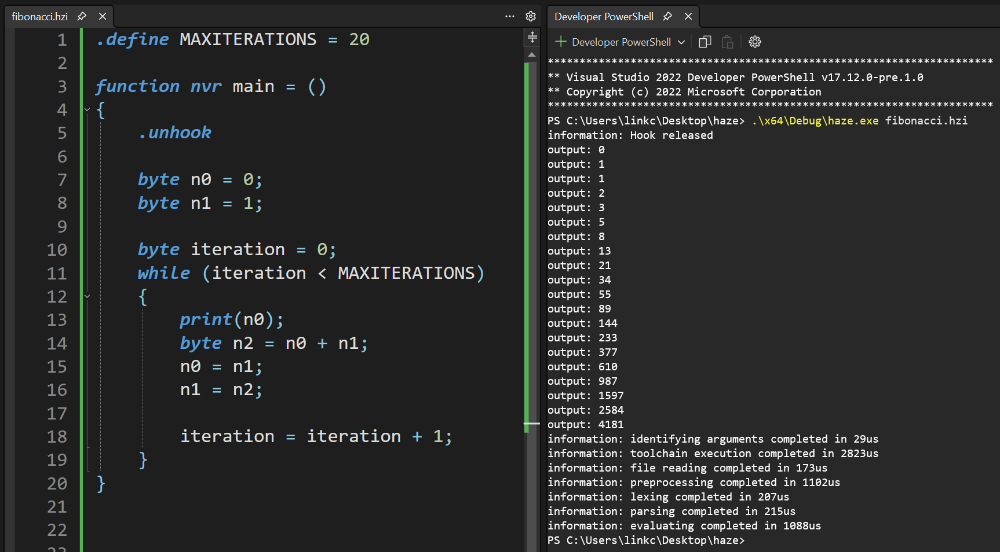

# HAZE
> A bespoke, from-scratch, full-stack, machine-code–level x86 optimizing compiler for Windows.

## MAIN FEATURES
- Fully custom assembly language and assembler
- Fully custom compiler
  - x86_64 and x86 CPU support
  - Custom Win32 PE .exe exporter
- Fully custom interpreter
  - Used for constant evaluation optimizations

## INTERPRETED FIBONACCI PROGRAM

## RELATED PROJECTS
- _haze-ls_, my fully LSP-compliant language server featuring contextual autocompletion and custom syntax highlighting published on the Visual Studio Code Extension Marketplace.
  - [https://github.com/connorjlink/haze-ls](https://github.com/connorjlink/haze-ls)
  - [https://marketplace.visualstudio.com/items?itemName=connorjlink.haze-ls](https://marketplace.visualstudio.com/items?itemName=connorjlink.haze-ls)
- _clarity_, my scratch-built source code editor, LSP-compliant language server, and web-based data visualization tool for the Haze compiler.
  - [https://github.com/connorjlink/clarity](https://github.com/connorjlink/clarity)