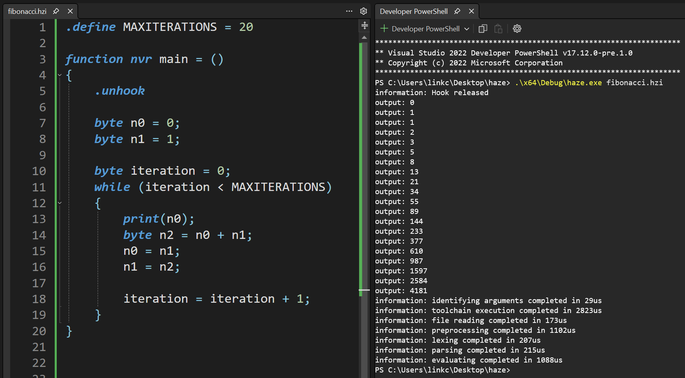

# HAZE
> A bespoke, from-scratch, full-stack, machine-code–level x86 & RISC-V optimizing compiler for Windows and bare metal.

## MAIN FEATURES
- Fully custom RISC-V assembly language and assembler
- Fully custom optimizing compiler, parallelized across translation units
  - x86 and RISC-V CPU support
  - Custom linker and Win32 PE .exe exporter
  - Support for exporting bare-metal object code
- Fully custom interpreter
  - Used for constant evaluation optimizations

## INTERPRETED FIBONACCI PROGRAM

## RELATED PROJECTS
- _haze-ls_, my fully LSP-compliant language server featuring contextual autocompletion and custom syntax highlighting published on the Visual Studio Code Extension Marketplace.
  - [https://github.com/connorjlink/haze-ls](https://github.com/connorjlink/haze-ls)
  - [https://marketplace.visualstudio.com/items?itemName=connorjlink.haze-ls](https://marketplace.visualstudio.com/items?itemName=connorjlink.haze-ls)
- _clarity_, my scratch-built source code editor, LSP-compliant language server, and web-based data visualization tool for the Haze compiler.
  - [https://github.com/connorjlink/clarity](https://github.com/connorjlink/clarity)
- _mist_, my ground-up DAP server written in Rust for real-time interaction with and inspection of _haze_ processes in the _clarity_ interface.
  - [https://github.com/connorjlink/mist](https://github.com/connorjlink/mist)
- _stratus_, my barebones x86 & RISC-V based operating system kernel written predominantly in C upon which Haze executables aim to run.
  - [https://github.com/connorjlink/stratus](https://github.com/connorjlink/stratus)
- _horizon_, my five-stage pipelined, multithreaded RISC-V processor architecture engineered in SystemVerilog and VHDL designed to run on FPGA hardware.
  - [https://github.com/connorjlink/horizon](https://github.com/connorjlink/horizon)  
